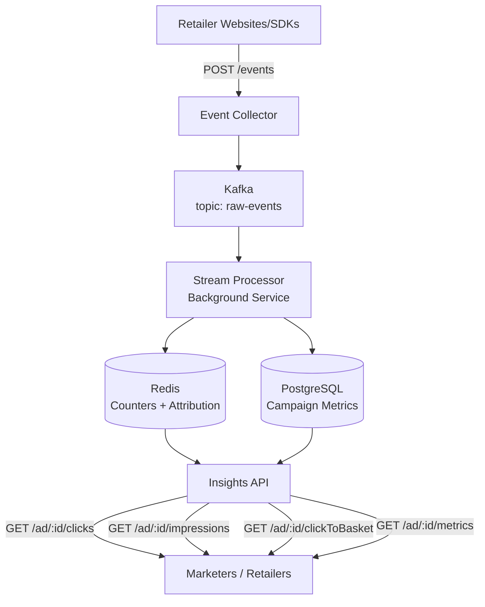
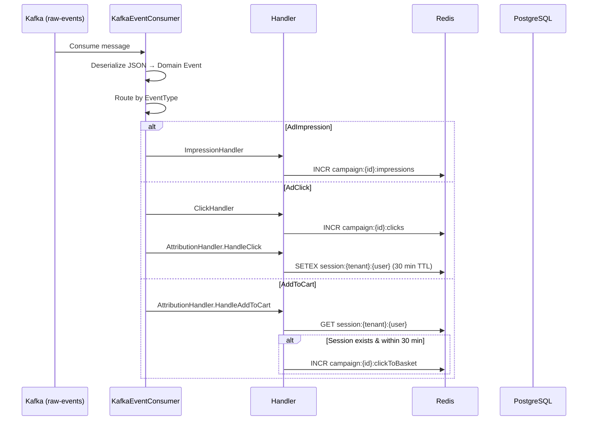

# Retail Media Streaming Platform

Real-time platform for processing ad engagement events and generating campaign insights at scale. Built for the Technical Leadership Round — Architect interview assignment.

---

## Table of Contents

- [System Design](#system-design)
- [Architecture Principles](#architecture-principles)
- [Technology Stack](#technology-stack)
- [Project Structure](#project-structure)
- [Event Ingestion & Schema](#event-ingestion--schema)
- [Data Processing Pipeline](#data-processing-pipeline)
- [Data Storage Strategy](#data-storage-strategy)
- [Insights API](#insights-api)
- [Multi-Tenancy](#multi-tenancy)
- [Scalability](#scalability)
- [Deployment](#deployment)
- [Monitoring & Observability](#monitoring--observability)
- [Challenges & Trade-offs](#challenges--trade-offs)
- [Cost Optimization](#cost-optimization)
- [Running Locally](#running-locally)
- [Future Enhancements](#future-enhancements)

---

## System Design



**Three services, three infrastructure dependencies:**

```
                     ┌──────────────┐     ┌──────────────┐
                     │ EventCollector│────▶│    Kafka     │
                     │  POST /events │     │ raw-events   │
                     │  Port 5001    │     └──────┬───────┘
                     └──────────────┘            │
                                                 ▼
                     ┌──────────────┐     ┌──────────────┐
                     │  Insights API│     │StreamProcessor│
                     │  Port 5000   │     │  Background   │
                      │  .NET 10     │     │  Worker .NET  │
                     └──────┬───────┘     └──────┬───────┘
                            │                    │
                     ┌──────┴──────┐      ┌──────┴──────┐
                     │  PostgreSQL │      │    Redis     │
                     │  Metrics    │      │  Counters +  │
                     │  + Entities │      │  Sessions    │
                     └─────────────┘      └─────────────┘
```

---

## Architecture Principles

The codebase follows **Clean Architecture** (Ports & Adapters) with 4 layers:

```
┌──────────────────────────────────────────────────────┐
│  RetailMedia.Api          (Web API / Presentation)    │
│  RetailMedia.EventCollector (Web API / Event Ingress) │
│  RetailMedia.StreamProcessor (Worker / Event Egress)  │
├──────────────────────────────────────────────────────┤
│  RetailMedia.Application    (Use Cases / Services)    │
├──────────────────────────────────────────────────────┤
│  RetailMedia.Infrastructure (Persistence, Caching,    │
│                              Messaging, EF Migrations) │
├──────────────────────────────────────────────────────┤
│  RetailMedia.Domain         (Entities, Value Objects,  │
│                              Repository Interfaces)    │
└──────────────────────────────────────────────────────┘
```

**Dependency Rule:** Dependencies point inward. Domain has zero external dependencies.

**SOLID in practice:**
- **Single Responsibility** — One handler per event type (ClickHandler, ImpressionHandler, AttributionHandler)
- **Open/Closed** — New event types = new handler class; no modification to existing domain logic
- **Dependency Inversion** — Domain defines interfaces (ports), Infrastructure implements them (adapters)
- **Interface Segregation** — Separate repository interfaces per aggregate (ICampaignRepository, IEventRepository, IMetricsRepository)

---

## Technology Stack

| Layer | Technology | Rationale |
|-------|-----------|-----------|
| **API Framework** | .NET 10 Minimal API | Less ceremony than MVC, full DI + middleware support |
| **Stream Processing** | .NET 10 Background Service | Same conceptual model as Flink (consume → process → state → sink), no cluster overhead |
| **Event Bus** | Apache Kafka (Confluent.Kafka) | Durable, replayable, partitioned — industry standard |
| **Cache** | Redis (StackExchange.Redis) | Atomic INCR, TTL-based sessions, sub-millisecond reads |
| **Database** | PostgreSQL (EF Core + Dapper) | Strong consistency, relational model, migrations built-in |
| **Container** | Docker + docker-compose | Local dev parity with production |
| **Orchestration** | Kubernetes (Kustomize) | HPA, self-healing, rolling updates |
| **CI/CD** | GitHub Actions | Build → test → docker → deploy |
| **Testing** | xUnit + Moq | Unit + integration test support |

---

## Project Structure

```
src/
├── RetailMedia.Domain/               # Layer 0: Entities, Value Objects, Interfaces
│   ├── Entities/                     # Campaign, Event, CampaignMetric
│   ├── ValueObjects/                 # CampaignId, TenantId, EventType (enum)
│   └── Interfaces/                   # ICampaignRepository, IEventRepository, etc.
│
├── RetailMedia.Application/          # Layer 1: Use cases, DTOs
│   ├── Services/                     # EventIngestionService, InsightsService
│   ├── DTOs/                         # IngestEventRequest, MetricsResponse, etc.
│   └── Interfaces/                   # IEventIngestionService, IInsightsService
│
├── RetailMedia.Infrastructure/       # Layer 2: Adapters
│   ├── Persistence/                  # AppDbContext, Repositories, Migrations
│   ├── Caching/                      # RedisCache
│   └── Messaging/                    # KafkaProducer
│
├── RetailMedia.Api/                  # Layer 3a: Insights API (port 5000)
│   ├── Endpoints/                    # CampaignEndpoints
│   └── Middleware/                   # TenantContext, ErrorHandling
│
├── RetailMedia.EventCollector/       # Layer 3b: Event Ingestion (port 5001)
│   └── Endpoints/                    # EventEndpoints
│
└── RetailMedia.StreamProcessor/      # Layer 3c: Background Worker
    ├── Handlers/                     # ClickHandler, ImpressionHandler, AttributionHandler
    ├── KafkaEventConsumer.cs
    └── RedisFlushService.cs

tests/
├── RetailMedia.Api.Tests/
├── RetailMedia.Application.Tests/
└── RetailMedia.StreamProcessor.Tests/

k8s/                                  # Kubernetes manifests (Kustomize)
├── api-deployment.yaml               # 3 replicas, HPA-aware, liveness/readiness probes
├── api-hpa.yaml                      # HPA: 3-20 replicas, CPU 70%, Memory 80%
├── processor-deployment.yaml         # 2 replicas
└── configmap.yaml

.github/workflows/
├── ci.yml                            # Build, test with Postgres/Redis, docker build
└── cd.yml                            # Build, test, push to GCR, deploy to GKE
```

---

## Event Ingestion & Schema

### Event Types

| Event Type | Description | Handled? |
|-----------|-------------|----------|
| `AdImpression` | User viewed an ad | ✅ ImpressionHandler |
| `AdClick` | User clicked an ad | ✅ ClickHandler + AttributionHandler |
| `AddToCart` | User added item to cart | ✅ AttributionHandler (attribution check) |
| `ProductView` | User viewed a product page | ❌ Default (no-op) |
| `Purchase` | User completed a purchase | ❌ Default (no-op) |

### Event Schema

```json
{
  "eventId": "evt_001",
  "tenantId": "tesco",
  "userId": "u_456",
  "campaignId": "cmp_789",
  "eventType": "AD_CLICK",
  "timestamp": "2026-06-16T10:00:00Z",
  "metadata": {
    "productId": "prod_123",
    "source": "homepage_banner"
  }
}
```

### Ingestion Flow

```
Client → POST /events → EventCollector → validate → KafkaProducer → Kafka (raw-events)
         (202 Accepted)                                              (topic)
```

- **Kafka partitioning key:** `{tenantId}:{campaignId}` — ordering guarantee per campaign
- **Client response:** 202 Accepted (fire-and-forget, no wait for processing)
- **Error handling:** Invalid EventType → 400 Bad Request; Kafka failures → error logged, client gets 202 (event not guaranteed — add retry for production)

---

## Data Processing Pipeline



### Attribution Model

**Last-click attribution** with a 30-minute session window:

1. User clicks ad → Redis stores `session:{tenant}:{user}` with campaign ID + timestamp (TTL = 30 min)
2. User adds item to cart → Redis checks for existing session
3. If session exists and is within 30 min → increment `clickToBasket` counter
4. If no session or window expired → no attribution (silent no-op)

### Consumer Configuration

| Parameter | Value | Why |
|-----------|-------|-----|
| `GroupId` | `retail-media-processor` | Consumer group for horizontal scaling |
| `AutoOffsetReset` | `Earliest` | Process all events from start on first run |
| `EnableAutoCommit` | `false` | Manual commit — at-least-once delivery |

---

## Data Storage Strategy

### Layer 1: Redis (Real-time Counters & Sessions)

```
Key Pattern                          Example
─────────────────────────────────────────────────────
campaign:{campaignId}:clicks         campaign:cmp-789:clicks
campaign:{campaignId}:impressions    campaign:cmp-789:impressions
campaign:{campaignId}:clickToBasket  campaign:cmp-789:clickToBasket
session:{tenantId}:{userId}          session:tesco:u_456  (TTL: 1800s)
```

**Operations:** INCR for counters, GETSET for atomic read-and-reset, SETEX for session TTL.

### Layer 2: PostgreSQL (Persisted Metrics & Entities)

**Schema (3 tables):**

```
Campaigns
├── Id (text PK)          — CampaignId value object stored as string
├── TenantId (text)       — TenantId value object stored as string
├── Name (varchar 256)
├── IsActive (bool)
├── CreatedAt, UpdatedAt (timestamps)
└── Index: (TenantId, Id)

Events
├── EventId (varchar 128 PK)
├── TenantId (text)
├── UserId (varchar 128)
├── CampaignId (text)
├── Type (varchar 32)     — EventType enum stored as string
├── Timestamp
├── Metadata (jsonb)
└── Index: (TenantId, CampaignId, Timestamp)

CampaignMetrics
├── Id (bigint PK, auto)
├── TenantId (text)
├── CampaignId (text)
├── Metric (varchar 32)   — MetricType enum stored as string
├── Count (bigint)
├── Date (date)
└── Index: (TenantId, CampaignId, Metric, Date)
```

### Read Strategy (Cache-Aside)

```
API Request
    │
    ├── Redis GET → real-time counter value
    │
    └── PostgreSQL SUM → persisted aggregate value
              │
         Combined = Redis + PostgreSQL
              │
         Response: { data: { clicks: combined }, meta }
```

Redis gives sub-millisecond reads for real-time counters. PostgreSQL provides durable storage with historical data. The `/metrics` endpoint additionally supports date-range filtering via EF Core.

---

## Insights API

### Endpoints

| Method | Path | Description | Real-time? |
|--------|------|-------------|------------|
| `GET` | `/ad/{campaignId}/clicks` | Click count for campaign | ✅ Redis + PostgreSQL |
| `GET` | `/ad/{campaignId}/impressions` | Impression count | ✅ Redis + PostgreSQL |
| `GET` | `/ad/{campaignId}/clickToBasket` | Attributed add-to-cart count | ✅ Redis + PostgreSQL |
| `GET` | `/ad/{campaignId}/metrics` | Unified metrics with date filters | ⚠️ PostgreSQL only |
| `POST` | `/events` | Ingest engagement event | N/A (ingestion) |
| `GET` | `/healthz` | Health check | N/A |

### Metrics Query Parameters

```
GET /ad/{campaignId}/metrics?metric=clicks&startDate=2026-01-01&endDate=2026-01-31
```

| Param | Type | Description |
|-------|------|-------------|
| `metric` | string | Filter: `clicks`, `impressions`, `clicktobasket` (optional) |
| `startDate` | date | Inclusive start (optional) |
| `endDate` | date | Inclusive end (optional) |

### Response Format

All endpoints return a consistent JSON envelope:

```json
{
  "data": {
    "campaignId": "cmp_789",
    "clicks": 1542,
    "impressions": 45000,
    "clickToBasket": 89,
    "startDate": "2026-01-01",
    "endDate": "2026-01-31"
  },
  "meta": {
    "timestamp": "2026-06-16T12:00:00Z"
  }
}
```

---

## Multi-Tenancy

### Strategy

**Shared infrastructure with logical isolation** via `tenantId` column on every table.

### Tenant Resolution

1. JWT claim `tenantId` (preferred — for authenticated requests)
2. `X-Tenant-Id` header (fallback — for API key auth)
3. Returns **401 Unauthorized** if no tenant found

### Implementation

```csharp
// TenantContextMiddleware extracts tenant from request
// TenantContext (scoped per request) stores CurrentTenantId
// All repository queries filter by TenantId:
_db.Campaigns.Where(c => c.TenantId == tenantId && c.Id == campaignId)
```

### Data Isolation

| Concern | Approach |
|---------|----------|
| **Storage** | Shared DB, all tables have `TenantId` column |
| **Queries** | Every repository method filters by `TenantId` |
| **Caching** | Redis keys prefixed with tenant context |
| **Auth** | JWT validation ensures tenant matches token |
| **Enterprise tenants** | Dedicated DB per tenant if needed (design supports migration) |

---

## Scalability

### Strategy

Three-layer scaling — let Kafka absorb spikes, auto-scale stateless services, partition for parallelism.

### Kafka Partitioning

```
Partition key: {tenantId}:{campaignId}
Benefits:
  • Ordering guarantee per campaign (all events for campaign → same partition)
  • Even distribution across partitions (campaign spread)
  • Horizontal scalability (add partitions → add consumers)
```

### Horizontal Scaling

| Service | Strategy | Notes |
|---------|----------|-------|
| **EventCollector** | Stateless HTTP — add replicas behind load balancer | No session affinity needed |
| **StreamProcessor** | Kafka consumer group — add consumers as partitions increase | At most one consumer per partition |
| **RetailMedia.Api** | K8s HPA — CPU 70% / Memory 80% | 3-20 replicas configured |

### Kubernetes Autoscaling

```yaml
# api-hpa.yaml
minReplicas: 3
maxReplicas: 20
metrics:
  - type: Resource
    resource:
      name: cpu
      target:
        type: Utilization
        averageUtilization: 70
  - type: Resource
    resource:
      name: memory
      target:
        type: Utilization
        averageUtilization: 80
```

### Load Balancing

- **External:** Cloud load balancer → K8s Service → Pods
- **Kafka:** Partitions distributed across brokers; consumers within group balance partitions automatically
- **Read replicas:** PostgreSQL read replicas serve API queries; writes go to primary

---

## Deployment

### Kubernetes Topology

```
                    ┌──────────────────────┐
                    │   Cloud Load Balancer │
                    └──────────┬───────────┘
                               │
                    ┌──────────┴───────────┐
                    │   Ingress / Gateway   │
                    │   (Traefik/nginx)     │
                    └──────────┬───────────┘
                               │
         ┌─────────────────────┼─────────────────────┐
         │                     │                     │
         ▼                     ▼                     ▼
┌─────────────────┐   ┌─────────────────┐   ┌─────────────────┐
│  EventCollector │   │  RetailMedia.Api│   │StreamProcessor  │
│  Deployment     │   │  Deployment     │   │  Deployment     │
│  Replicas: 2-10 │   │  Replicas: 3-20 │   │  Replicas: 2-10 │
│  HPA: CPU 70%   │   │  HPA: CPU 70%   │   │  HPA: CPU 70%   │
└────────┬────────┘   └────────┬────────┘   └────────┬────────┘
         │                     │                     │
         ▼                     ▼                     ▼
┌──────────────────────────────────────────────────────────┐
│                    Kafka Cluster                          │
│              (3 brokers, 6 partitions)                    │
└──────────────────────────────────────────────────────────┘
         │                     │                     │
         ▼                     ▼                     ▼
┌──────────────────┐   ┌──────────────────┐   ┌──────────────────┐
│   Redis Sentinel │   │  PostgreSQL      │   │   S3 / GCS       │
│   (HA mode)      │   │  Primary + Read  │   │   (Future)       │
│                  │   │  Replica         │   │                  │
└──────────────────┘   └──────────────────┘   └──────────────────┘
```

### Local Development

```bash
docker-compose up -d postgres redis kafka   # Start dependencies
make run-api                                 # http://localhost:5000 (insights)
make run-collector                           # http://localhost:5001 (ingestion)
make run-processor                           # Background worker (no port)
# OR
make dev                                     # All at once
```

### Docker Compose

```bash
docker-compose up --build -d    # Start everything
docker-compose down             # Stop
```

### Testing

```bash
dotnet test
```

---

## Monitoring & Observability

| Aspect | Implementation |
|--------|---------------|
| **Health Checks** | `/healthz` endpoint on all services (liveness + readiness) |
| **Logging** | Structured JSON logging via `ILogger<T>` with event IDs |
| **Metrics** | Prometheus-compatible via OpenTelemetry (configurable) |
| **Tracing** | OpenTelemetry support for distributed tracing across services |
| **K8s Probes** | Liveness + readiness configured in deployment manifests |

### Key Metrics to Monitor

| Metric | Where | Target |
|--------|-------|--------|
| API P95 latency | RetailMedia.Api | < 200ms |
| Event ingestion rate | EventCollector | Track baseline; alert on drop >20% |
| Kafka consumer lag | StreamProcessor | < 10,000 messages |
| Redis memory usage | Redis | < 80% of maxmemory |
| PostgreSQL connections | PostgreSQL | < 80% of max |
| Error rate (5xx) | All services | < 1% |

---

## Challenges & Trade-offs

| Trade-off | Choice | Rationale |
|-----------|--------|-----------|
| **Real-time vs Accuracy** | Redis counters for speed; nightly reconciliation for precision | Users see near-real-time counts; batch jobs correct drift |
| **PostgreSQL vs Cassandra** | PostgreSQL now; Cassandra if >100K writes/sec | Consistency + migrations now; scale via read replicas |
| **Redis as counter** | Fast INCR/GET; 8-byte loss on crash; flushed periodically | Cache-aside pattern covers reads; flush needs implementation |
| **Shared vs per-tenant DB** | Shared with tenantId column; dedicated if enterprise | Cost efficiency; migration path to dedicated if needed |
| **Kafka partition skew** | Partition by tenantId:campaignId; sub-partitions for large campaigns | Ordering per campaign; skew mitigated by campaign diversity |
| **Stream processing engine** | .NET BackgroundService vs Apache Flink | Same conceptual model; Flink warranted at 500M+ events/day |

### Common Interview Questions

**Why not Apache Flink?**
For this scope (50M events/day, simple stateful operations), a BackgroundService with manual Kafka commits achieves the same result without Flink cluster overhead. The migration path is clean — handlers are already isolated classes. Flink becomes necessary for exactly-once guarantees, event-time processing with watermarks, and backpressure management at higher throughput.

**How do you handle 10x Black Friday traffic?**
1. Kafka absorbs the spike — producers publish at full rate, consumers catch up when traffic subsides
2. K8s HPA auto-scales stateless services (API, Collector)
3. StreamProcessor scales with Kafka partitions
4. Degraded mode: Redis-only counters if PostgreSQL is saturated; DB catches up after spike

---

## Cost Optimization

| Layer | Cost Driver | Optimization |
|-------|-------------|-------------|
| **Kafka** | Storage (retention) | 7-day retention; move older events to S3 |
| **Redis** | Memory | Session TTL (auto-expiry); eviction: allkeys-lru |
| **PostgreSQL** | Storage + connections | Read replicas; PgBouncer for connection pooling |
| **K8s** | Compute | HPA scales down at low traffic; spot VMs for processor |
| **Storage** | Archival | Lifecycle: Standard → Infrequent Access → Glacier |

---

## Running Locally

### Prerequisites

- .NET 10 SDK
- Docker Desktop
- `make` (built-in on macOS, `choco install make` on Windows)

### Quick Start

```bash
# 1. Start infrastructure (PostgreSQL, Redis, Kafka)
docker-compose up -d postgres redis zookeeper kafka

# 2. Start services (3 separate terminals)
make run-api          # http://localhost:5000 — query API
make run-collector    # http://localhost:5229 — event ingestion
make run-processor    # Kafka consumer — processes events

# Or everything in Docker containers:
make docker-up
```

## End-to-End Test Walkthrough

### 1. Verify all services are healthy

```bash
curl http://localhost:5000/healthz       # → Healthy
curl http://localhost:5229/healthz       # → Healthy
```

### 2. Ingest events (the full funnel)

Open a terminal and send these events in order:

```bash
# AdClick — starts a 30-min attribution session
curl -X POST http://localhost:5229/events \
  -H "Content-Type: application/json" \
  -d '{"eventId":"e2e_001","tenantId":"tesco","userId":"alice","campaignId":"cmp_summer","eventType":"AdClick","timestamp":"2026-06-16T10:00:00Z"}'

# AdImpression — counts an impression
curl -X POST http://localhost:5229/events \
  -H "Content-Type: application/json" \
  -d '{"eventId":"e2e_002","tenantId":"tesco","userId":"alice","campaignId":"cmp_summer","eventType":"AdImpression","timestamp":"2026-06-16T10:01:00Z"}'

# AddToCart — within 30 min → attributed to the click
curl -X POST http://localhost:5229/events \
  -H "Content-Type: application/json" \
  -d '{"eventId":"e2e_003","tenantId":"tesco","userId":"alice","campaignId":"cmp_summer","eventType":"AddToCart","timestamp":"2026-06-16T10:15:00Z"}'

# ProductView — recorded but no special processing
curl -X POST http://localhost:5229/events \
  -H "Content-Type: application/json" \
  -d '{"eventId":"e2e_004","tenantId":"tesco","userId":"alice","campaignId":"cmp_summer","eventType":"ProductView","timestamp":"2026-06-16T10:20:00Z"}'
```

Each returns `202 Accepted` with the event ID.

### 3. Query campaign insights

```bash
# Campaign metrics (with tenant header)
curl -H "X-Tenant-Id: tesco" http://localhost:5000/ad/cmp_summer/clicks
curl -H "X-Tenant-Id: tesco" http://localhost:5000/ad/cmp_summer/impressions
curl -H "X-Tenant-Id: tesco" http://localhost:5000/ad/cmp_summer/clickToBasket
curl -H "X-Tenant-Id: tesco" "http://localhost:5000/ad/cmp_summer/metrics"

# Expected output:
# clicks        → {"clicks": 1}
# impressions   → {"impressions": 1}
# clickToBasket → {"clickToBasket": 1}   (attributed within 30-min window)
# metrics       → {"clicks": 1, "impressions": 1, "clickToBasket": 1}
```

### 4. Verify data at each layer

After ingesting events, confirm the data flows through every service:

```bash
# ── Kafka: check raw events in the topic ──
docker exec retail-kafka kafka-console-consumer \
  --bootstrap-server localhost:9092 \
  --topic raw-events \
  --from-beginning \
  --max-messages 3

# ── Redis: check counters and click sessions ──
docker exec retail-redis redis-cli keys '*'
# Sample output:
#   campaign:cmp_summer:clicks
#   campaign:cmp_summer:impressions
#   campaign:cmp_summer:clickToBasket
#   session:tesco:alice

docker exec retail-redis redis-cli GET "campaign:cmp_summer:clicks"
# → "1"

docker exec retail-redis redis-cli GET "campaign:cmp_summer:clickToBasket"
# → "1"

docker exec retail-redis redis-cli GET "session:tesco:alice"
# → {"campaignId":"cmp_summer","timestamp":"2026-06-16T10:00:00Z"}

# ── PostgreSQL: check persisted events ──
docker exec retail-postgres psql -U retail -d retail_media -c \
  "SELECT \"EventId\", \"Type\", \"TenantId\", \"CampaignId\", \"UserId\", \"Timestamp\" FROM \"Events\";"
# Sample output:
#  EventId  |    Type    | TenantId | CampaignId   | UserId |      Timestamp
# ----------+------------+----------+--------------+--------+---------------------
#  e2e_001  | AdClick    | tesco    | cmp_summer   | alice  | 2026-06-16 10:00:00
#  e2e_002  | AdImpression| tesco   | cmp_summer   | alice  | 2026-06-16 10:01:00
#  e2e_003  | AddToCart  | tesco    | cmp_summer   | alice  | 2026-06-16 10:15:00
#  e2e_004  | ProductView| tesco    | cmp_summer   | alice  | 2026-06-16 10:20:00

# ── Consumer group status ──
docker exec retail-kafka kafka-consumer-groups \
  --bootstrap-server localhost:9092 \
  --describe --group retail-media-processor
# Shows: CURRENT-OFFSET, LOG-END-OFFSET, LAG (should be 0 if all consumed)
```

### 5. Expired attribution (over 30 min)

```bash
# Click at 09:00
curl -X POST http://localhost:5229/events \
  -H "Content-Type: application/json" \
  -d '{"eventId":"e2e_exp_01","tenantId":"tesco","userId":"bob","campaignId":"cmp_autumn","eventType":"AdClick","timestamp":"2026-06-16T09:00:00Z"}'

# AddToCart at 10:00 (60 min later — session expired)
curl -X POST http://localhost:5229/events \
  -H "Content-Type: application/json" \
  -d '{"eventId":"e2e_exp_02","tenantId":"tesco","userId":"bob","campaignId":"cmp_autumn","eventType":"AddToCart","timestamp":"2026-06-16T10:00:00Z"}'

# Verify: clickToBasket stays 0
curl -H "X-Tenant-Id: tesco" http://localhost:5000/ad/cmp_autumn/clickToBasket
# → {"clickToBasket": 0}
```

## Docker Commands

### Managing services

```bash
# Start all services (in containers, not local dotnet)
docker-compose up --build -d

# Start individual services
docker-compose up -d postgres redis zookeeper kafka
docker-compose up -d api processor collector

# Stop everything
docker-compose down

# Stop individual services
docker-compose stop postgres

# Rebuild and restart a single service
docker-compose up -d --build api

# View resource usage
docker stats
```

### Viewing logs

```bash
# Follow all service logs
docker-compose logs -f

# Follow a specific service
docker-compose logs -f api
docker-compose logs -f processor
docker-compose logs -f collector
docker-compose logs -f kafka

# Last 100 lines with timestamps
docker-compose logs --tail=100 -t processor

# Search logs for errors
docker-compose logs processor | grep -i error

# Local dotnet process logs (when running via make)
# Logs go to stdout; use terminal multiplexer (tmux, iTerm panes)
```

### Kafka troubleshooting

```bash
# List topics
docker exec retail-kafka kafka-topics --list --bootstrap-server localhost:9092

# Describe a topic
docker exec retail-kafka kafka-topics --describe --topic raw-events --bootstrap-server localhost:9092

# Consume messages (view raw events)
docker exec retail-kafka kafka-console-consumer \
  --bootstrap-server localhost:9092 \
  --topic raw-events \
  --from-beginning \
  --max-messages 5

# Get consumer group status
docker exec retail-kafka kafka-consumer-groups \
  --bootstrap-server localhost:9092 \
  --describe --group retail-media-processor
```

### Database & Cache

```bash
# Connect to PostgreSQL
docker exec -it retail-postgres psql -U retail -d retail_media
# Then: \dt — list tables
#       SELECT * FROM "Events"; — view events

# Connect to Redis
docker exec -it retail-redis redis-cli
# Then: keys * — list all keys
#       GET "campaign:cmp_summer:clicks" — get click count
```

---

## Future Enhancements

- **Real-time dashboards** — WebSocket / SSE push to marketer dashboards
- **ML-based attribution** — Multi-touch models (linear, time-decay, algorithmic)
- **Budget pacing** — Real-time budget checks; stop serving when budget exhausted
- **Fraud detection** — Anomaly detection on click patterns (bot detection)
- **BigQuery integration** — Historical analytics and BI reporting
- **Prometheus + Grafana** — Production-grade monitoring dashboards

---

## Further Reading

| Document | Description |
|----------|-------------|
| [`docs/Architecture_Diagrams.md`](docs/Architecture_Diagrams.md) | HLD, LLD, class diagrams, sequence diagrams |
| [`docs/Use_Case_Walkthroughs.md`](docs/Use_Case_Walkthroughs.md) | End-to-end walkthroughs with dummy data for all event types |
| [`docs/System_Understanding.md`](docs/System_Understanding.md) | How implementation maps to interview requirements, design decisions, limitations |
| [`docs/Scope_For_Extension.md`](docs/Scope_For_Extension.md) | Production extensions: fan-in/fan-out, Flink, data lake, cost optimization, interview talking points |
