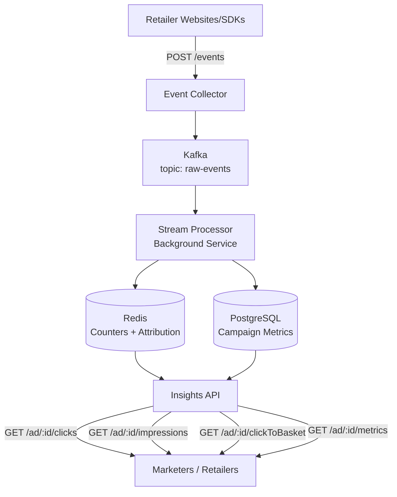

# Retail Media Streaming Platform

Real-time Retail Media platform for processing ad engagement events and generating campaign insights at scale. Built for the Technical Leadership Round — Architect interview assignment.

## System Design



## Architecture

```
┌─────────────────────────────────────────────────────┐
│                 API Gateway / Ingress                │
├──────────────────────┬──────────────────────────────┤
│   Insights API       │   Event Collector             │
│   Port 5000          │   Port 5001                   │
│   Minimal API .NET 8 │   POST /events → Kafka        │
├──────────────────────┴──────────────────────────────┤
│              Kafka (raw-events topic)                │
├─────────────────────────────────────────────────────┤
│           Stream Processor (Background Service)      │
│  ┌──────────┐  ┌───────────┐  ┌──────────────────┐  │
│  │  Click   │  │Impression │  │  Attribution     │  │
│  │  Handler │  │  Handler  │  │  Handler         │  │
│  └────┬─────┘  └────┬──────┘  └───────┬──────────┘  │
│       └──────────────┼────────────────┘              │
│                      ▼                               │
│  ┌──────────────────────────────────────┐            │
│  │          Redis Cache                  │            │
│  │  campaign:{id}:clicks                │            │
│  │  campaign:{id}:impressions           │            │
│  │  campaign:{id}:clickToBasket         │            │
│  │  session:{tenant}:{user} (TTL)       │            │
│  └──────────────────┬───────────────────┘            │
│                     ▼                                 │
│  ┌──────────────────────────────────────┐            │
│  │        PostgreSQL                     │            │
│  │  campaigns, events, campaign_metrics  │            │
│  └──────────────────────────────────────┘            │
└─────────────────────────────────────────────────────┘
```

## Tech Stack

| Layer | Technology |
|-------|-----------|
| API | .NET 8 Minimal API |
| Stream Processing | .NET 8 Background Service |
| Event Bus | Kafka (Confluent.Kafka) |
| Cache | Redis (StackExchange.Redis) |
| Database | PostgreSQL (EF Core + Dapper) |
| Container | Docker + docker-compose |
| Orchestration | Kubernetes |
| CI/CD | GitHub Actions |
| Testing | xUnit + Moq + TestServer |

## Project Structure

```
src/
├── RetailMedia.Api/                  # Minimal API host (port 5000)
│   ├── Program.cs                    # Entry point, DI, middleware
│   ├── Endpoints/                    # Campaign endpoints
│   └── Middleware/                   # Tenant + error handling
├── RetailMedia.Domain/               # Entities, value objects, interfaces
├── RetailMedia.Application/          # Services, DTOs, use cases
├── RetailMedia.Infrastructure/       # PostgreSQL, Redis, Kafka implementations
├── RetailMedia.StreamProcessor/      # Kafka consumer workers
└── RetailMedia.EventCollector/       # Event ingestion service (port 5001)
```

## API Endpoints

### Campaign Insights

```
GET /ad/{campaignId}/clicks         → Click count
GET /ad/{campaignId}/impressions    → Impression count
GET /ad/{campaignId}/clickToBasket  → Attributed add-to-cart count
GET /ad/{campaignId}/metrics?metric=clicks&startDate=2026-01-01&endDate=2026-01-31
```

### Event Ingestion

```
POST /events
Content-Type: application/json

{
  "eventId": "evt_001",
  "tenantId": "tesco",
  "userId": "u_456",
  "campaignId": "cmp_789",
  "eventType": "AD_CLICK",
  "timestamp": "2026-06-16T10:00:00Z",
  "metadata": { "productId": "prod_123", "source": "homepage_banner" }
}
```

### Health

```
GET /healthz    → Health check
```

All insight endpoints require `X-Tenant-Id` header or JWT `tenantId` claim.

## Multi-Tenancy

- Tenant identified via `X-Tenant-Id` header or JWT claim `tenantId`
- All database queries filtered by `tenant_id`
- Logical isolation within shared infrastructure
- Scoped `ITenantContext` per request

## Event Processing Pipeline

1. **Event Collector**: Validates event schema, publishes to Kafka topic `raw-events`
2. **Kafka Partitioning**: Keyed by `tenantId:campaigntId` for ordering per campaign
3. **Stream Processor**: Consumes from Kafka, routes by event type:
   - `AD_CLICK` → ClickHandler (increment Redis + AttributionHandler)
   - `AD_IMPRESSION` → ImpressionHandler (increment Redis)
   - `ADD_TO_CART` → AttributionHandler (check session window)
4. **Attribution Window**: 30-minute session stored in Redis hash, tracks last-clicked campaign
5. **Cache-Aside**: API reads check Redis first, fall back to PostgreSQL; sum counts

## Running Locally

### Prerequisites

- .NET 8 SDK
- Docker Desktop

### Quick Start

```bash
# Start dependencies
docker-compose up -d postgres redis kafka

# Run services (in separate terminals)
make run-api        # http://localhost:5000
make run-collector  # http://localhost:5001
make run-processor

# Or all at once
make dev
```

### Docker Compose

```bash
# Start everything
docker-compose up --build -d

# Stop
docker-compose down
```

### Test

```bash
dotnet test
```

## Design Decisions

| Decision | Choice | Rationale |
|----------|--------|-----------|
| API pattern | Minimal API | Less ceremony, same DI + testability |
| Persistence | EF Core + Dapper | EF for writes/migrations, Dapper for reads |
| Caching | Cache-aside with Redis TTL | Stale-tolerant, 30-60s TTL |
| Partitioning | tenantId + campaignId | Ordering guarantee per campaign |
| Attribution | Redis session hash + TTL | In-memory speed, auto-expiry |
| Multi-tenancy | Shared DB, tenantId column | Lower cost, logical isolation |

## Trade-offs

- **Real-time vs Accuracy**: Redis counters for low-latency reads; nightly reconciliation for precision
- **PostgreSQL vs Cassandra**: PostgreSQL now (consistency, familiar); Cassandra if >100K writes/sec
- **Redis as counter**: Fast, but potential 8-byte loss on crash; flushed to PostgreSQL periodically
- **Single DB vs dedicated per tenant**: Shared for cost efficiency; dedicated clusters for enterprise retailers
- **Partition skew**: Large campaigns may hotspot; mitigated by sub-partitions if needed

## Monitoring & Observability

- Health checks: `/healthz` (liveness + readiness)
- Logging: Structured JSON logging via `ILogger<T>`
- Metrics: Prometheus-compatible via OpenTelemetry (configurable)
- Tracing: OpenTelemetry support for distributed tracing

## Future Enhancements

- Real-time dashboards (WebSocket + Server-Sent Events)
- ML-based attribution models
- Budget pacing and campaign budget management
- Fraud detection pipeline
- BigQuery integration for historical analytics
- Prometheus + Grafana dashboards
