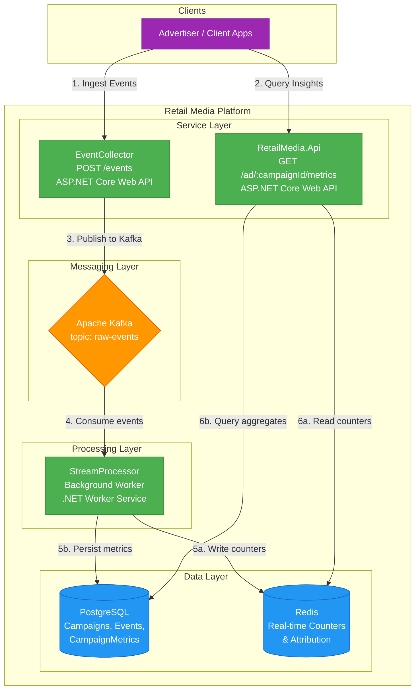
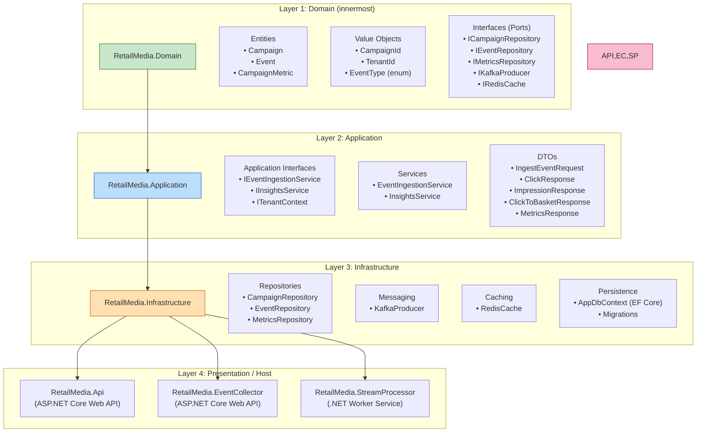
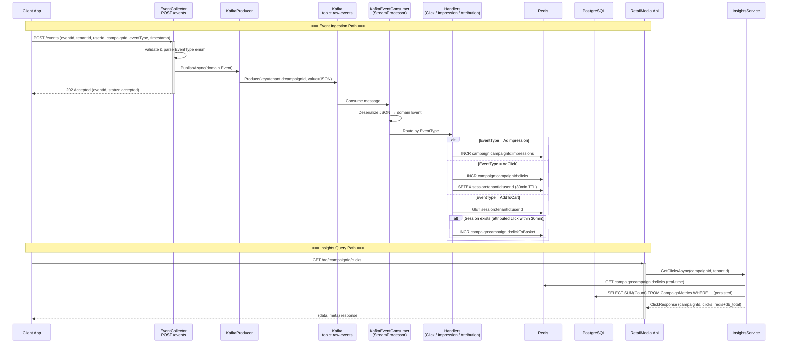

# Architecture Diagrams — Retail Media Streaming Platform

---

## 1. High-Level Design (HLD)

### HLD Data Flows

| Step | Source | Target | Description |
|------|--------|--------|-------------|
| 1 | Client | EventCollector | POST raw events (ProductView, AddToCart, Purchase, AdImpression, AdClick) |
| 2 | Client | RetailMedia.Api | GET campaign metrics (clicks, impressions, click-to-basket) |
| 3 | EventCollector | Kafka | Publishes validated events to `raw-events` topic |
| 4 | Kafka | StreamProcessor | Consumes events in a background worker |
| 5a | StreamProcessor | Redis | Increments real-time counters per campaign |
| 5b | StreamProcessor | PostgreSQL | Upserts CampaignMetrics (write-along at event time) |
| 6a | RetailMedia.Api | Redis | Reads real-time counter values |
| 6b | RetailMedia.Api | PostgreSQL | Reads persisted aggregate metrics with date filters |

---

## 2. Low-Level Design (LLD)

### 2.1 Clean Architecture — Layered Structure

### 2.2 Internal Class Diagram

```mermaid
classDiagram
    %% ========== Domain Layer ==========
    class Campaign {
        +CampaignId Id
        +TenantId TenantId
        +string Name
        +bool IsActive
        +DateTime CreatedAt
        +DateTime UpdatedAt
        +Deactivate()
        +Rename(string)
    }

    class Event {
        +string EventId
        +TenantId TenantId
        +string UserId
        +CampaignId CampaignId
        +EventType Type
        +DateTime Timestamp
        +Dictionary~string,string~? Metadata
    }

    class CampaignMetric {
        +long Id
        +TenantId TenantId
        +CampaignId CampaignId
        +MetricType Metric
        +long Count
        +DateTime Date
        +Increment(long)
    }

    class CampaignId {
        +string Value
        +From(string) CampaignId
    }

    class TenantId {
        +string Value
        +From(string) TenantId
    }

    class EventType {
        <<enum>>
        ProductView
        AddToCart
        Purchase
        AdImpression
        AdClick
    }

    class MetricType {
        <<enum>>
        Clicks
        Impressions
        ClickToBasket
    }

    %% Domain Interfaces
    class ICampaignRepository {
        <<interface>>
        +GetByIdAsync(CampaignId, TenantId) Campaign?
        +GetByTenantAsync(TenantId) IReadOnlyList~Campaign~
        +AddAsync(Campaign)
        +UpdateAsync(Campaign)
    }

    class IEventRepository {
        <<interface>>
        +AddAsync(Event)
        +GetByCampaignAsync(CampaignId, TenantId, DateTime?, DateTime?) IReadOnlyList~Event~
    }

    class IMetricsRepository {
        <<interface>>
        +GetClickCountAsync(CampaignId, TenantId) long
        +GetImpressionCountAsync(CampaignId, TenantId) long
        +GetClickToBasketCountAsync(CampaignId, TenantId) long
        +UpsertMetricAsync(CampaignMetric)
        +GetMetricsAsync(CampaignId, TenantId, MetricType?, DateTime?, DateTime?) IReadOnlyList~CampaignMetric~
    }

    class IKafkaProducer {
        <<interface>>
        +PublishAsync(Event)
    }

    class IRedisCache {
        <<interface>>
        +IncrementCounterAsync(string, long) long
        +GetCounterAsync(string) long
        +SetAsync~T~(string, T, TimeSpan?)
        +GetAsync~T~(string) T?
        +KeyExistsAsync(string) bool
        +GetAndResetCounterAsync(string) long
    }

    %% ========== Application Layer ==========
    class IEventIngestionService {
        <<interface>>
        +IngestAsync(IngestEventRequest)
    }

    class IInsightsService {
        <<interface>>
        +GetClicksAsync(CampaignId, TenantId) ClickResponse
        +GetImpressionsAsync(CampaignId, TenantId) ImpressionResponse
        +GetClickToBasketAsync(CampaignId, TenantId) ClickToBasketResponse
        +GetMetricsAsync(CampaignId, TenantId, string?, DateTime?, DateTime?) MetricsResponse
    }

    class ITenantContext {
        <<interface>>
        +TenantId CurrentTenantId
    }

    class EventIngestionService {
        -IKafkaProducer _kafkaProducer
        -IEventRepository _eventRepo
        +IngestAsync(IngestEventRequest)
    }

    class InsightsService {
        -IRedisCache _cache
        -IMetricsRepository _metricsRepo
        +GetClicksAsync()
        +GetImpressionsAsync()
        +GetClickToBasketAsync()
        +GetMetricsAsync()
    }

    class IngestEventRequest {
        +string EventId
        +string TenantId
        +string UserId
        +string CampaignId
        +string EventType
        +DateTime Timestamp
        +Dictionary~string,string~? Metadata
    }

    class MetricsResponse {
        +string CampaignId
        +long? Clicks
        +long? Impressions
        +long? ClickToBasket
        +DateTime? StartDate
        +DateTime? EndDate
    }

    %% ========== Infrastructure Layer ==========
    class AppDbContext {
        +DbSet~Campaign~ Campaigns
        +DbSet~Event~ Events
        +DbSet~CampaignMetric~ CampaignMetrics
        +OnModelCreating(ModelBuilder)
    }

    class CampaignRepository {
        -AppDbContext _db
        +GetByIdAsync() Campaign?
        +GetByTenantAsync() IReadOnlyList~Campaign~
        +AddAsync(Campaign)
        +UpdateAsync(Campaign)
    }

    class EventRepository {
        -AppDbContext _db
        +AddAsync(Event)
        +GetByCampaignAsync() IReadOnlyList~Event~
    }

    class MetricsRepository {
        -AppDbContext _db
        -string _connectionString
        +GetClickCountAsync() long
        +GetImpressionCountAsync() long
        +GetClickToBasketCountAsync() long
        +UpsertMetricAsync(CampaignMetric)
        +GetMetricsAsync() IReadOnlyList~CampaignMetric~
    }

    class KafkaProducer {
        -IProducer~string,string~ _producer
        +PublishAsync(Event)
    }

    class RedisCache {
        -ConnectionMultiplexer _redis
        -IDatabase _db
        +IncrementCounterAsync() long
        +GetCounterAsync() long
        +SetAsync~T~()
        +GetAsync~T~() T?
        +KeyExistsAsync() bool
        +GetAndResetCounterAsync() long
    }

    %% ========== Presentation Layer ==========
    class CampaignEndpoints {
        +MapCampaignEndpoints(WebApplication)
        GET /ad/:campaignId/clicks
        GET /ad/:campaignId/impressions
        GET /ad/:campaignId/clickToBasket
        GET /ad/:campaignId/metrics
    }

    class EventEndpoints {
        +MapEventEndpoints(WebApplication)
        POST /events
    }

    class TenantContextMiddleware {
        +InvokeAsync(HttpContext, RequestDelegate)
    }

    class ErrorHandlingMiddleware {
        +InvokeAsync(HttpContext, RequestDelegate)
    }

    class KafkaEventConsumer {
        -IConsumer~string,string~ _consumer
        +ExecuteAsync(CancellationToken)
        -ProcessMessageAsync(Message, CancellationToken)
    }

    class ClickHandler {
        +HandleAsync(Event) Task
    }

    class ImpressionHandler {
        +HandleAsync(Event) Task
    }

    class AttributionHandler {
        +HandleClickAsync(Event) Task
        +HandleAddToCartAsync(Event) Task
    }

    %% ========== Relationships ==========
    EventIngestionService --> IKafkaProducer
    EventIngestionService --> IEventRepository
    InsightsService --> IRedisCache
    InsightsService --> IMetricsRepository

    CampaignRepository ..|> ICampaignRepository
    CampaignRepository --> AppDbContext

    EventRepository ..|> IEventRepository
    EventRepository --> AppDbContext

    MetricsRepository ..|> IMetricsRepository
    MetricsRepository --> AppDbContext

    KafkaProducer ..|> IKafkaProducer
    RedisCache ..|> IRedisCache

    CampaignEndpoints --> IInsightsService
    CampaignEndpoints --> ITenantContext

    EventEndpoints --> IEventIngestionService

    KafkaEventConsumer --> ClickHandler
    KafkaEventConsumer --> ImpressionHandler
    KafkaEventConsumer --> AttributionHandler

    ClickHandler --> IRedisCache
    ImpressionHandler --> IRedisCache
    AttributionHandler --> IRedisCache

    Event --> EventType
    Event --> CampaignId
    Event --> TenantId
    Campaign --> CampaignId
    Campaign --> TenantId
    CampaignMetric --> CampaignId
    CampaignMetric --> TenantId
    CampaignMetric --> MetricType
```

### 2.3 Event Flow Sequence (Detailed)

---

## 3. Key Architectural Decisions

| Decision | Choice | Rationale |
|----------|--------|-----------|
| **Architecture Pattern** | Clean Architecture (Ports & Adapters) | Domain independence, testability, swap infrastructure without touching business logic |
| **Event Streaming** | Apache Kafka | Durable, ordered, replayable event log; decouples ingestion from processing |
| **Real-time Counters** | Redis (StackExchange.Redis) | Sub-millisecond INCR operations; TTL-based session expiry for attribution |
| **Persistence** | PostgreSQL (EF Core + Dapper) | EF Core for CRUD; Dapper for raw aggregate SUM queries (performance) |
| **Multi-tenancy** | TenantId value object + middleware | Middleware extracts tenant from JWT claim or X-Tenant-Id header; all queries scoped by tenant |
| **Migration Strategy** | Auto-apply on startup (`db.Database.Migrate()`) | Simplifies deployment; no manual migration steps |
| **Persistence Strategy** | Write-along (Redis + PostgreSQL at event time) | Every processed event writes counters to Redis and upserts aggregated metrics + raw event to PostgreSQL. No periodic flush needed. |
