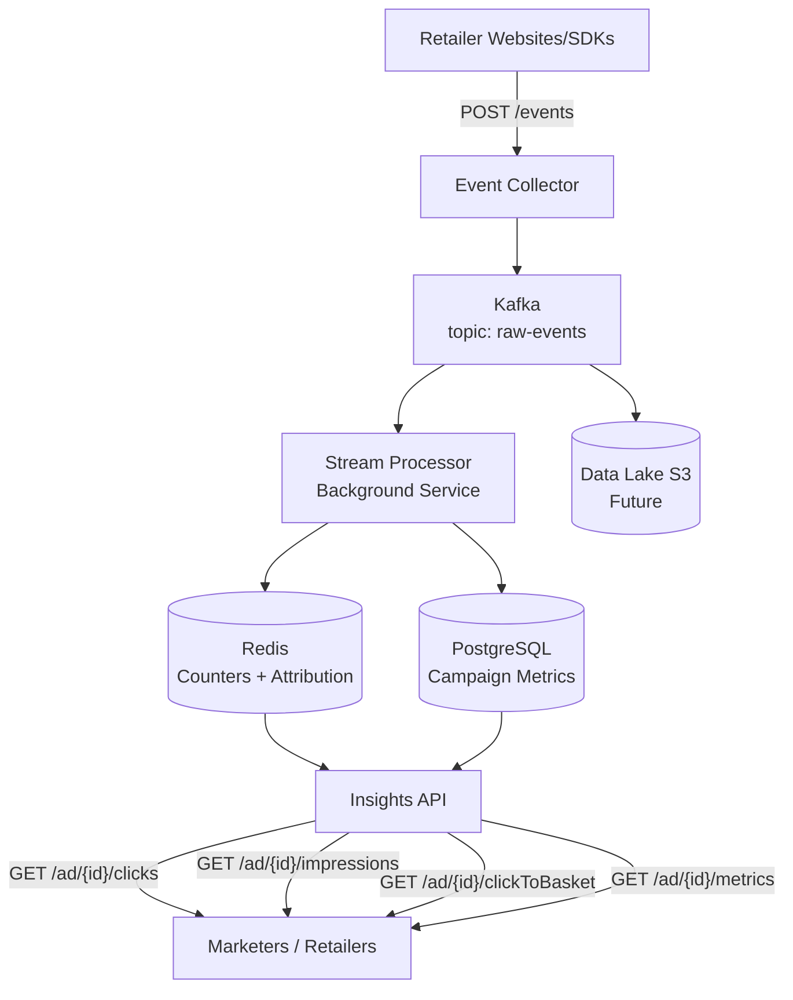

# Retail Media Streaming Platform — Implementation Plan

## Overview

Build a production-grade Retail Media Platform for the Technical Leadership Round—Architect interview assignment. The platform ingests customer and ad engagement events, processes them in real-time, and exposes campaign insights via REST APIs.

## Tech Stack

| Layer | Technology | Rationale |
|-------|-----------|-----------|
| API Layer | .NET 8 Minimal API | Modern, minimal ceremony, Go-sensibility |
| Stream Processing | .NET 8 Background Service | Full pipeline from Kafka → Redis → PostgreSQL |
| Event Bus | Apache Kafka (Confluent.Kafka) | High-throughput, durable, replayable |
| Cache | Redis (StackExchange.Redis) | Low-latency counters, session store |
| OLTP | PostgreSQL (EF Core + Dapper) | Strong consistency, migrations built-in |
| Container | Docker + docker-compose | Local dev parity with prod |
| Orchestration | Kubernetes | HPA, self-healing, rolling updates |
| CI/CD | GitHub Actions | Build → test → docker → deploy |
| Monitoring | Health checks + structured logging | built-in |

## Project Structure

```
retail-media-streaming-platform/
├── src/
│   ├── RetailMedia.Api/                  # Minimal API host
│   │   ├── Program.cs                    # Entry point, DI, middleware
│   │   ├── Endpoints/
│   │   │   └── CampaignEndpoints.cs      # MapGet/MapPost handlers
│   │   ├── Middleware/
│   │   │   ├── TenantContextMiddleware.cs
│   │   │   └── ErrorHandlingMiddleware.cs
│   │   ├── appsettings.json
│   │   └── RetailMedia.Api.csproj
│   │
│   ├── RetailMedia.Domain/               # Pure domain (zero dependencies)
│   │   ├── Entities/
│   │   ├── ValueObjects/
│   │   └── Interfaces/
│   │   └── RetailMedia.Domain.csproj
│   │
│   ├── RetailMedia.Application/          # Use cases / orchestration
│   │   ├── Services/
│   │   ├── DTOs/
│   │   └── Interfaces/
│   │   └── RetailMedia.Application.csproj
│   │
│   ├── RetailMedia.Infrastructure/       # Data access + messaging
│   │   ├── Persistence/
│   │   │   ├── AppDbContext.cs
│   │   │   ├── Repositories/
│   │   │   └── Migrations/
│   │   ├── Caching/
│   │   │   └── RedisCache.cs
│   │   └── Messaging/
│   │       ├── KafkaProducer.cs
│   │       └── KafkaConsumer.cs
│   │   └── RetailMedia.Infrastructure.csproj
│   │
│   ├── RetailMedia.StreamProcessor/      # Kafka consumer worker
│   │   ├── Program.cs
│   │   ├── Handlers/
│   │   │   ├── ClickHandler.cs
│   │   │   ├── ImpressionHandler.cs
│   │   │   └── AttributionHandler.cs
│   │   └── RetailMedia.StreamProcessor.csproj
│   │
│   └── RetailMedia.EventCollector/       # Event ingestion service
│       ├── Program.cs
│       └── Endpoints/
│           └── EventEndpoints.cs
│       └── RetailMedia.EventCollector.csproj
│
├── tests/
│   ├── RetailMedia.Api.Tests/
│   ├── RetailMedia.Application.Tests/
│   └── RetailMedia.StreamProcessor.Tests/
│
├── k8s/
│   ├── api-deployment.yaml
│   ├── api-service.yaml
│   ├── api-hpa.yaml
│   ├── stream-processor-deployment.yaml
│   ├── configmap.yaml
│   └── kustomization.yaml
│
├── .github/workflows/
│   ├── ci.yml
│   └── cd.yml
│
├── docker-compose.yml
├── Dockerfile
├── Makefile
├── .gitignore
├── .editorconfig
└── README.md
```

## System Design



## API Endpoints

| Method | Path | Description |
|--------|------|-------------|
| GET | `/ad/{campaignId}/clicks` | Click count for campaign |
| GET | `/ad/{campaignId}/impressions` | Impression count for campaign |
| GET | `/ad/{campaignId}/clickToBasket` | Attributed add-to-cart count |
| GET | `/ad/{campaignId}/metrics?metric=clicks&startDate=...&endDate=...` | Unified metrics with filters |
| POST | `/events` | Ingest engagement event |
| GET | `/healthz` | Health check |

## Phases

### Phase 1: Scaffold
- Create .NET solution with 6 projects
- .gitignore, .editorconfig, Makefile
- docker-compose.yml with PostgreSQL, Redis, Kafka, Zookeeper
- Multi-stage Dockerfile

### Phase 2: Domain Layer
- Entities: Campaign, Event, CampaignMetric
- Value Objects: CampaignId, TenantId, EventType
- Interfaces: ICampaignRepository, IEventRepository, IMetricsRepository, IRedisCache

### Phase 3: Infrastructure Layer
- EF Core DbContext + migrations (campaigns, events, campaign_metrics tables)
- Repository implementations
- Redis cache with counter operations + TTL
- Kafka producer + consumer (BackgroundService)

### Phase 4: API Endpoints
- Minimal API: app.MapGroup("/ad/{campaignId}")
- 4 GET endpoints with DI
- Consistent JSON envelope: `{ data, meta, errors }`
- Input validation + error handling

### Phase 5: Multi-Tenancy
- TenantContextMiddleware: extract tenantId from JWT/header
- Scoped TenantContext per request
- All queries filtered by tenant_id
- Per-tenant rate limiting

### Phase 6: Event Ingestion
- POST /events endpoint
- Schema validation
- Publish to Kafka topic raw-events
- Partitioned by tenantId+campaignId

### Phase 7: Stream Processor
- Kafka consumer reading raw-events
- Event router → ClickHandler, ImpressionHandler, AttributionHandler
- Click-to-basket attribution: Redis session state with attribution window
- Write-along persistence: Redis counters + PostgreSQL upserts at event time

### Phase 8: Testing
- Unit tests: domain logic, service layer (xUnit + Moq)
- Integration tests: API endpoints with Testcontainers (PostgreSQL, Redis)
- Stream processor tests with in-memory Kafka

### Phase 9: DevOps
- GitHub Actions CI: dotnet build → test → docker build → push
- GitHub Actions CD: deploy to K8s
- K8s manifests: deployments, services, HPA, configmap
- Health checks + readiness/liveness probes

### Phase 10: Documentation
- README with Mermaid architecture diagram
- API documentation
- Design decisions and trade-offs
- How to run locally

## Key Design Decisions

| Decision | Choice | Rationale |
|----------|--------|-----------|
| API pattern | Minimal API | Less ceremony than MVC, same DI/testability |
| ORM | EF Core + Dapper (reads) | EF for writes/migrations, Dapper for high-read endpoints |
| Caching | Cache-aside with Redis | TTL 30-60s, stale-tolerant for metrics counters |
| Kafka client | Confluent.Kafka | Industry standard for .NET |
| Partitioning | tenantId + campaignId | Ordering guarantee per campaign |
| Attribution | Redis hash + TTL | User session state with configurable window |
| Multi-tenancy | Single DB, tenantId column | Lower ops cost, logical isolation |
| Testing | Testcontainers | Real PostgreSQL/Redis in CI, not mocks |
| Container | Distroless .NET 8 | ~100MB final image, minimal attack surface |

## Trade-offs (Interview Discussion)

- **Real-time vs Accuracy**: Redis counters for speed + nightly batch reconciliation for precision
- **PostgreSQL vs Cassandra**: PG now (team familiarity, consistency), Cassandra if >100K writes/sec
- **Redis as counter**: Fast but 8-byte loss window; write-along to PG at event time
- **Single DB per tenant vs shared**: Shared with tenantId column for cost; dedicated clusters for enterprise retailers
- **Kafka partition skew**: Large campaigns may hotspot; mitigated by sub-partitions or randomized suffix

## Event Schema

```json
{
  "eventId": "evt_001",
  "tenantId": "tesco",
  "userId": "u_456",
  "campaignId": "cmp_789",
  "eventType": "AD_CLICK",
  "timestamp": "2026-06-16T10:00:00Z",
  "metadata": {
    "productId": "prod_123",
    "source": "homepage_banner"
  }
}
```

## Event Types

- `PRODUCT_VIEW`
- `ADD_TO_CART`
- `PURCHASE`
- `AD_IMPRESSION`
- `AD_CLICK`
