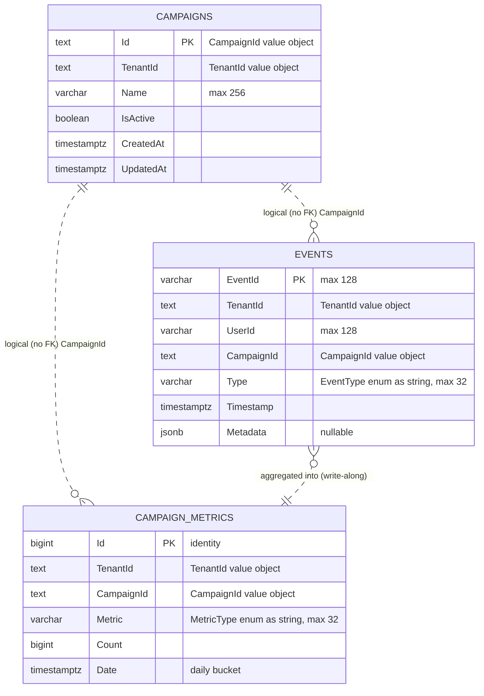

# Database Schema & Events Mapping — Retail Media Streaming Platform

> **Context:** This document describes the PostgreSQL schema (tables, columns, indexes, type mappings) and maps each incoming `EventType` to the Redis counters and `CampaignMetrics` rows it produces. Source of truth: `AppDbContext.OnModelCreating` and the `InitialCreate` migration.

---

## 1. Overview

| Aspect | Detail |
|--------|--------|
| **Engine** | PostgreSQL (Npgsql provider) |
| **Access — writes** | EF Core via `AppDbContext` (`src/RetailMedia.Infrastructure/Persistence/AppDbContext.cs`) |
| **Access — reads** | EF Core for filtered queries + Dapper for raw `SUM` aggregates (`MetricsRepository.cs`) |
| **Tables** | `Campaigns`, `Events`, `CampaignMetrics` |
| **Multi-tenancy** | Shared database; every row is keyed by `TenantId` (no per-tenant DB) |
| **Foreign keys** | None — tables are linked **logically** by `TenantId` / `CampaignId` for write throughput |
| **Migrations** | Auto-applied on startup via `db.Database.Migrate()` (`RetailMedia.Api/Program.cs:22`) |
| **Default connection** | `Host=localhost;Port=5433;Database=retail_media;Username=retail` (`DependencyInjection.cs:18`) |

---

## 2. Entity–Relationship Diagram

> Relationships are **non-identifying / logical only** — there are no database-level foreign key constraints. Joins are always scoped by `TenantId` first.

---

## 3. Table Definitions

### 3.1 `Campaigns`

Advertiser campaign master data. Entity: `RetailMedia.Domain.Entities.Campaign`.

| Column | Type | Nullable | Notes |
|--------|------|:--------:|-------|
| `Id` | `text` | No | **PK**. Maps from `CampaignId` value object |
| `TenantId` | `text` | No | Maps from `TenantId` value object |
| `Name` | `varchar(256)` | No | |
| `IsActive` | `boolean` | No | Toggled by `Campaign.Deactivate()` |
| `CreatedAt` | `timestamptz` | No | UTC |
| `UpdatedAt` | `timestamptz` | No | UTC, bumped on `Rename` / `Deactivate` |

**Indexes**
- `PK_Campaigns` (`Id`)
- `IX_Campaigns_TenantId_Id` (`TenantId`, `Id`)

### 3.2 `Events`

Raw event stream — **every consumed event is persisted here**, regardless of type. Entity: `RetailMedia.Domain.Entities.Event`.

| Column | Type | Nullable | Notes |
|--------|------|:--------:|-------|
| `EventId` | `varchar(128)` | No | **PK**. Client-supplied idempotency key |
| `TenantId` | `text` | No | Maps from `TenantId` value object |
| `UserId` | `varchar(128)` | No | |
| `CampaignId` | `text` | No | Maps from `CampaignId` value object |
| `Type` | `varchar(32)` | No | `EventType` enum stored as string |
| `Timestamp` | `timestamptz` | No | Event time |
| `Metadata` | `jsonb` | Yes | Free-form key/value; written as `null` by the stream consumer |

**Indexes**
- `PK_Events` (`EventId`)
- `IX_Events_TenantId_CampaignId_Timestamp` (`TenantId`, `CampaignId`, `Timestamp`)

### 3.3 `CampaignMetrics`

Pre-aggregated daily counters (the read-model behind the Insights API). Entity: `RetailMedia.Domain.Entities.CampaignMetric`.

| Column | Type | Nullable | Notes |
|--------|------|:--------:|-------|
| `Id` | `bigint` (identity) | No | **PK**. DB-generated |
| `TenantId` | `text` | No | Maps from `TenantId` value object |
| `CampaignId` | `text` | No | Maps from `CampaignId` value object |
| `Metric` | `varchar(32)` | No | `MetricType` enum stored as string |
| `Count` | `bigint` | No | Incremented via upsert (`CampaignMetric.Increment`) |
| `Date` | `timestamptz` | No | Day bucket — `event.Timestamp.Date` |

**Indexes**
- `PK_CampaignMetrics` (`Id`)
- `IX_CampaignMetrics_TenantId_CampaignId_Metric_Date` (`TenantId`, `CampaignId`, `Metric`, `Date`)

> **Upsert grain:** one row per `(TenantId, CampaignId, Metric, Date)`. `MetricsRepository.UpsertMetricAsync` looks up the existing row for that grain and calls `Increment`, otherwise inserts a new row.

---

## 4. Type Mappings (Value Objects & Enums)

Configured in `AppDbContext.OnModelCreating`:

| CLR type | Stored as | Conversion |
|----------|-----------|------------|
| `CampaignId` | `text` | `id => id.Value` / `CampaignId.From(value)` |
| `TenantId` | `text` | `id => id.Value` / `TenantId.From(value)` |
| `EventType` | `varchar(32)` | `HasConversion<string>()` |
| `MetricType` | `varchar(32)` | `HasConversion<string>()` |
| `Dictionary<string,string>?` (Metadata) | `jsonb` | Npgsql native JSON mapping |
| `CampaignMetric.Id` | `bigint` | `ValueGeneratedOnAdd()` (identity) |

---

## 5. Events → Storage Mapping

The `StreamProcessor` consumes from Kafka topic `raw-events` and routes by `EventType`
(`KafkaEventConsumer.ProcessMessageAsync`). The table below shows every side effect per event type.

| EventType | Handler(s) | Redis writes | `CampaignMetrics` row | `Events` row |
|-----------|-----------|--------------|------------------------|:-----------:|
| `AdClick` | `ClickHandler` + `AttributionHandler.HandleClickAsync` | `INCR campaign:{campaignId}:clicks` (24h TTL) **and** `SET session:{tenantId}:{userId}` (30 min TTL) | `Metric = Clicks`, `Count += 1`, `Date = Timestamp.Date` | ✅ |
| `AdImpression` | `ImpressionHandler` | `INCR campaign:{campaignId}:impressions` (24h TTL) | `Metric = Impressions`, `Count += 1`, `Date = Timestamp.Date` | ✅ |
| `AddToCart` | `AttributionHandler.HandleAddToCartAsync` | If a click session exists within the 30‑min window: `INCR campaign:{campaignId}:clickToBasket` (24h TTL) | `Metric = ClickToBasket`, `Count += 1` — **only when attributed** | ✅ |
| `ProductView` | none (default / no-op) | — | — | ✅ |
| `Purchase` | none (default / no-op) | — | — | ✅ |

> **Write-along persistence:** each handler writes to Redis (real-time) *and* upserts `CampaignMetrics` (durable) at event time. After all routing, `eventRepo.AddAsync` always persists the raw row to `Events` (`KafkaEventConsumer.cs:129`).

### 5.1 Attribution logic (`AddToCart`)

1. Read `session:{tenantId}:{userId}` from Redis.
2. If absent → no attribution, return.
3. Parse the stored click `timestamp`; if `now - clickTime > 30 min` → window expired, return.
4. Otherwise increment the `clickToBasket` Redis counter and upsert a `ClickToBasket` metric.

The session is created on `AdClick` with a 30‑minute TTL, holding `{ campaignId, timestamp }`.

---

## 6. Redis Key Reference (companion to the relational store)

Redis holds the hot/real-time view; the Insights API combines Redis + `CampaignMetrics`.

| Key pattern | Type | TTL | Written by |
|-------------|------|-----|------------|
| `campaign:{campaignId}:clicks` | counter | 24h | `ClickHandler` |
| `campaign:{campaignId}:impressions` | counter | 24h | `ImpressionHandler` |
| `campaign:{campaignId}:clickToBasket` | counter | 24h | `AttributionHandler` |
| `session:{tenantId}:{userId}` | hash/json | 30 min | `AttributionHandler.HandleClickAsync` |

---

## 7. Query Paths

| API endpoint | Source | SQL / query |
|--------------|--------|-------------|
| `GET /ad/{id}/clicks` | Redis + Dapper | `SELECT COALESCE(SUM("Count"),0) FROM "CampaignMetrics" WHERE "TenantId"=@t AND "CampaignId"=@c AND "Metric"='Clicks'` |
| `GET /ad/{id}/impressions` | Redis + Dapper | same with `Metric='Impressions'` |
| `GET /ad/{id}/clickToBasket` | Redis + Dapper | same with `Metric='ClickToBasket'` |
| `GET /ad/{id}/metrics?metric=&startDate=&endDate=` | EF Core | filtered `CampaignMetrics` query by `TenantId`, `CampaignId`, optional `Metric`/`Date` range (`MetricsRepository.GetMetricsAsync`) |

---

## 8. Source References

| Concern | File |
|---------|------|
| EF model & mappings | `src/RetailMedia.Infrastructure/Persistence/AppDbContext.cs` |
| Initial migration | `src/RetailMedia.Infrastructure/Migrations/20260616063946_InitialCreate.cs` |
| Model snapshot | `src/RetailMedia.Infrastructure/Migrations/AppDbContextModelSnapshot.cs` |
| Metrics read/upsert | `src/RetailMedia.Infrastructure/Persistence/Repositories/MetricsRepository.cs` |
| Event routing | `src/RetailMedia.StreamProcessor/KafkaEventConsumer.cs` |
| Handlers | `src/RetailMedia.StreamProcessor/Handlers/*.cs` |
| Entities | `src/RetailMedia.Domain/Entities/*.cs` |
